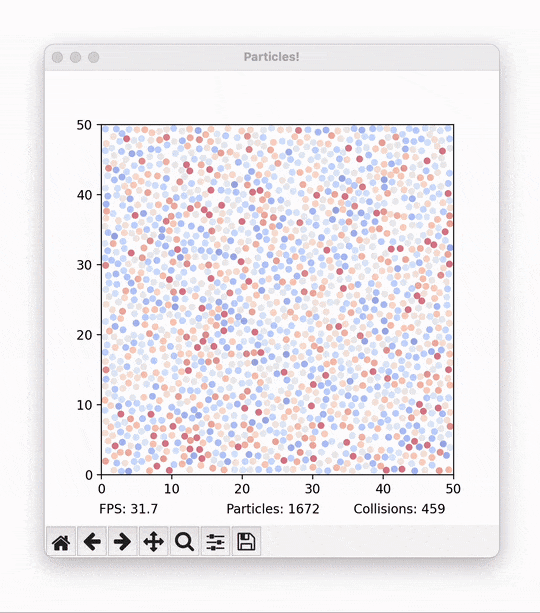
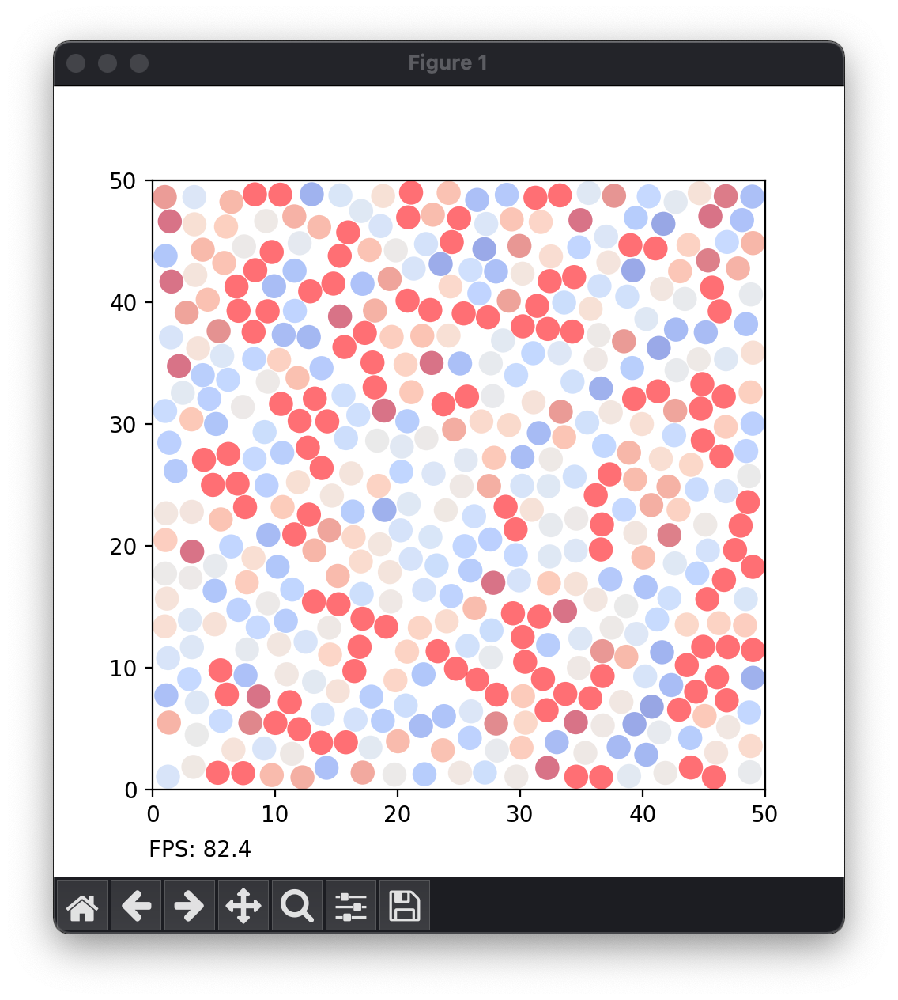
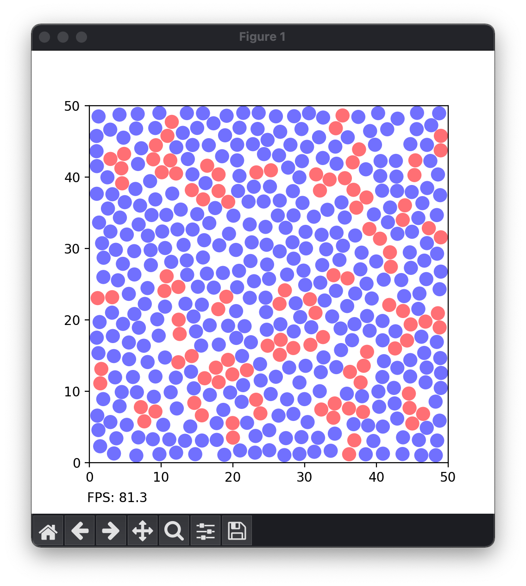
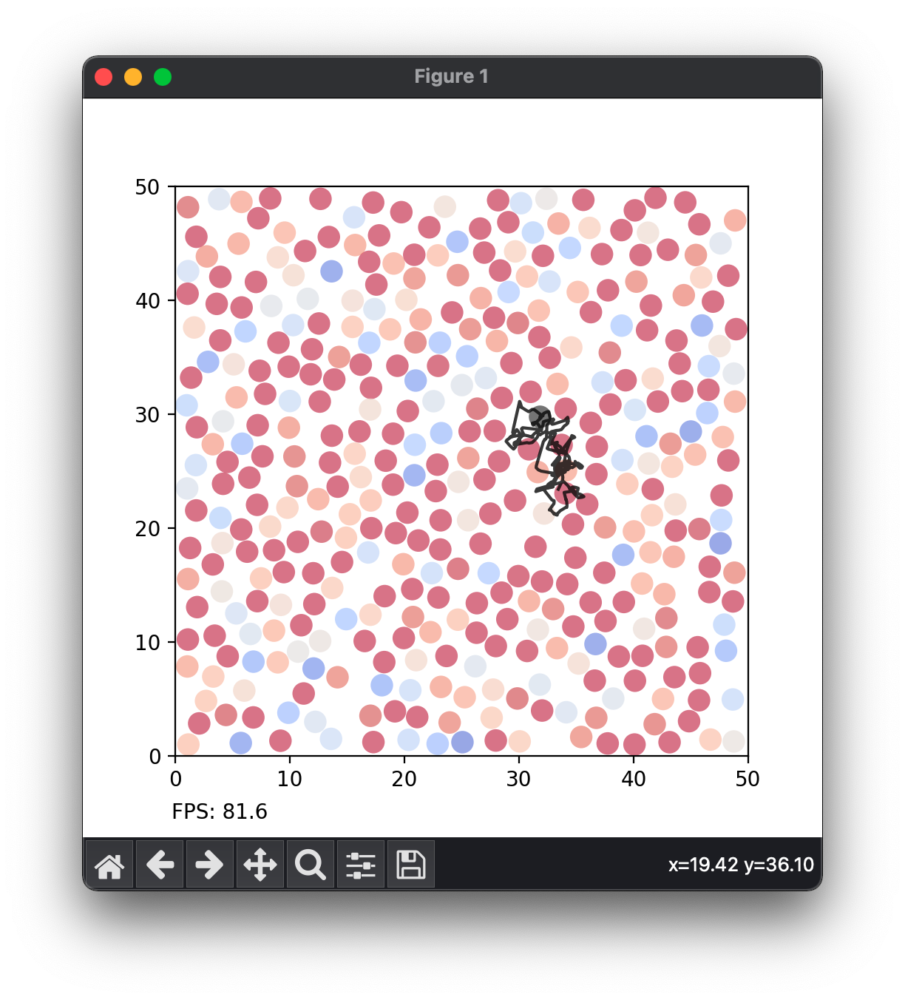

# Colloid Simulation
A simple simulation of colloidal substances, modeled through the collisions of hard spheres colliding in a solvent.



## Setup
You'll need at least Python 3.9 and a few packages to run this simulation. To install them, run:

```pip install -r requirements.txt```

## Customization
In `main.py`, you'll find a few different parameters defined in the `config` object:

```python
# define simulation parameters
config = {
    "size": 50,                             # size of simulation populated by particles
    "particle_concentration": 2.5,          # this controls particle spacing, must be twice particle radius
    "particle_radius": 1.,                  # radius of particles in simulation units
    "particle_mass": 1.,                    # mass, has no effect since all particles are the same
    "particle_drag": 0.,                    # multiplier for reduction in velocity at each time step
    "brownian_amplitude_initial": 1,        # magnitude of initial random velocity
    "brownian_amplitude_continuous": 0,     # adds brownian noise to particles at each step as in a gas
    "timestep": .1,                         # higher values will give less accurate results
    "show_grid": False,                     # requires significant render time
    "show_collisions": True,                # highlights particles when they collide
    "show_velocities": True                 # maps particle velocity to color
}
```

Play around with these to control how the simulation behaves!

## Running
To start the simulation as configured, run:

```python main.py```

This opens a matplotlib window. Closing this will terminate the simulation and return you to your prompt.

Once running, click a single particle to show its path through the simulation!

## Output
Here's a couple of examples of output:

Particles can be colored based on their current velocity (in config, `"show_velocities": True`)



And/or can be highlighted when colliding (in config, `"show_collisions": True`)



Here's what a particle's tracked motion looks like:

